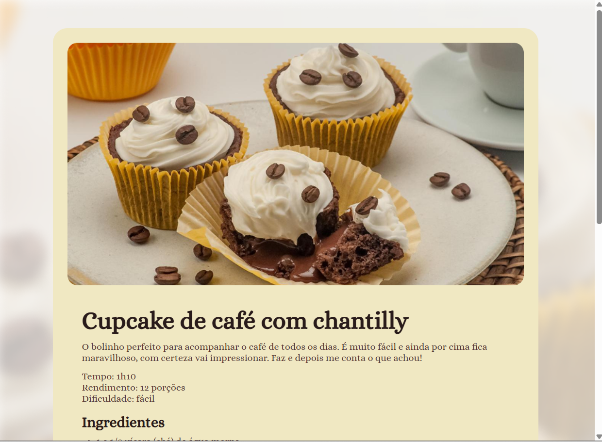

# 📖 Projeto: Página de Receita

Este é um projeto desenvolvido durante o **Módulo 3 da Formação Fullstack da Rocketseat**. A proposta foi criar uma página de receita culinária com HTML e CSS, praticando conceitos como:

- Estruturação semântica com HTML5
- Estilização com CSS3
- Organização de arquivos em pastas
- Utilização de imagens e SVGs

---

### 📸 Prévia do Projeto



> Cupcake de café com chantilly — o bolinho perfeito para acompanhar o café do dia a dia ☕🧁

---
## 📂 Estrutura de Pastas
```text
PÁGINA_DE_RECEITA/
├── assets/
│   ├── bg-image.png
│   ├── coracao.svg
│   └── main-image.png
├── index.html
├── style.css
└── docs/
    └── screenshot.png

## 🛠️ Tecnologias Utilizadas

- HTML5
- CSS3
- VSCode
